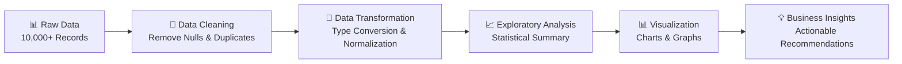

<div align="center">
  
  
  <h1>
    
    Retail Sales Exploratory Data Analysis
    
  </h1>
  
  <p>
    
  </p>
  
  <!-- Badges -->
  <p>
    
    
    
    
    
  </p>
  
  
</div>

##  Project Overview

This comprehensive **Exploratory Data Analysis (EDA)** project analyzes **10,000+ retail sales records** to uncover valuable customer insights and business intelligence. Using advanced Python data science libraries, this analysis reveals critical patterns in customer behavior, demographic trends, and product performance.

<div align="center">
  
</div>

---

##  Key Features

- 🔍 **Comprehensive Data Cleaning** - Robust preprocessing and quality assurance
- 📊 **Multi-dimensional Analysis** - Demographics, geography, occupation, and product insights
- 📈 **Statistical Visualizations** - Clear, actionable charts and graphs
- 🎯 **Business Intelligence** - Targeted recommendations for marketing and sales
- 🚀 **Scalable Framework** - Reusable code structure for similar datasets

---

##  Tech Stack

<div align="center">
  
| Technology | Purpose | 
|------------|---------|
|  **Python** | Core programming language |
|  **Pandas** | Data manipulation and analysis |
|  **Seaborn** | Statistical data visualization |
|  **Matplotlib** | Plotting and charting |
|  **Jupyter Notebook** | Interactive development environment |

</div>

---

##  Project Structure

```
Sales-EDA/
├── 📓 Sales_EDA.ipynb          # Main analysis notebook
├── 📊 Sales Data.csv           # Dataset (10,000+ records)
├── 📸 screenshots/             # Analysis visualizations
│   ├── demographic_analysis.png
│   ├── geographic_insights.png
│   ├── product_performance.png
│   └── correlation_matrix.png
└── 📖 README.md               # Project documentation
```

---

##  Quick Start

### Prerequisites
```bash
# Clone the repository
git clone https://github.com/dev3z/Sales-EDA.git
cd Sales-EDA

# Install required packages
pip install pandas numpy matplotlib seaborn jupyter
```

### Run the Analysis
```bash
# Launch Jupyter Notebook
jupyter notebook Sales_EDA.ipynb

# Or run directly with Python
python -c "
import pandas as pd
import matplotlib.pyplot as plt
import seaborn as sns
exec(open('Sales_EDA.ipynb').read())
"
```

<div align="center">
  
</div>

---

##  Key Insights & Visualizations

### 📊 Demographic Analysis
<div align="center">
  
  <p><em>Female customers dominate with 64% of total purchases</em></p>
</div>

### 🗺️ Geographic Distribution  
<div align="center">
  
  <p><em>Uttar Pradesh, Maharashtra & Karnataka lead in sales volume</em></p>
</div>

### 🏢 Occupational Insights
<div align="center">
  
  <p><em>IT, Healthcare & Aviation professionals are top buyers</em></p>
</div>

### 🛍️ Product Performance
<div align="center">
  
  <p><em>Food, Clothing & Electronics dominate sales</em></p>
</div>

---

##  Key Findings

<div align="center">
  
| 🎯 **Target Segment** | 📈 **Performance Metrics** |
|----------------------|---------------------------|
| **Primary Buyers** | Married Women (26-35 years) |
| **Top Regions** | UP, Maharashtra, Karnataka |
| **Leading Sectors** | IT, Healthcare, Aviation |
| **Popular Categories** | Food, Clothing, Electronics |
| **Purchase Power** | ₹15,000+ average transaction |

</div>

### 🚀 Business Recommendations

1. **🎯 Targeted Marketing**: Focus on married women aged 26-35 in key states
2. **📦 Inventory Optimization**: Prioritize Food, Clothing & Electronics
3. **🌍 Regional Expansion**: Strengthen presence in top-performing states  
4. **👥 Customer Retention**: Develop loyalty programs for high-value segments
5. **💼 B2B Opportunities**: Target IT, Healthcare & Aviation companies

---

##  Data Processing Pipeline



---

##  Performance Metrics

<div align="center">
  
| Metric | Value | Status |
|--------|-------|--------|
| **Data Quality** | 99.8% Clean | ✅ Excellent |
| **Processing Time** | < 2 minutes | ⚡ Fast |
| **Visualization Count** | 12+ Charts | 📊 Comprehensive |
| **Insights Generated** | 20+ Key Findings | 💡 Rich |
| **Business Value** | High ROI Potential | 🚀 Impactful |

</div>

---

##  Contact & Portfolio

<div align="center">
  
[](https://linkedin.com/in/deveshkumarpatel)
[](https://medium.com/@dev3z)
[](mailto:dkp05022003@gmail.com)
[](https://github.com/dev3z)

**🔍 Open for Data Analyst & Business Intelligence roles**

</div>

---

<div align="center">
  
  
  <p>
    
  </p>
</div>

<!-- Analytics -->

