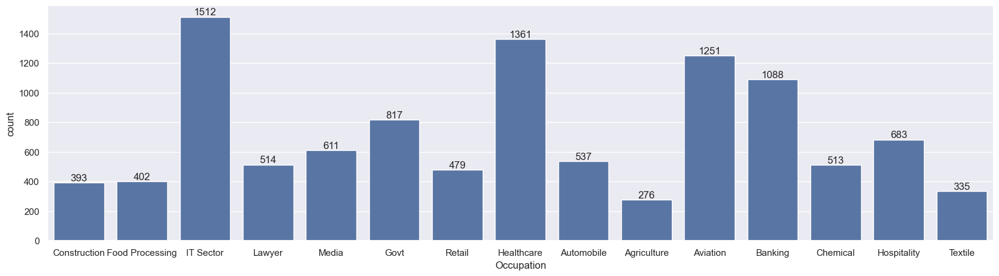

```mermaid
graph LR
    A[📊 Raw Data<br/>10,000+ Records] --> B[🧹 Data Cleaning<br/>Remove Nulls & Duplicates]
    B --> C[🔄 Data Transformation<br/>Type Conversion & Normalization]
    C --> D[📈 Exploratory Analysis<br/>Statistical Summary]
    D --> E[📊 Visualization<br/>Charts & Graphs]
    E --> F[💡 Business Insights<br/>Actionable Recommendations]
```

<div align="center">
  
  
  <h1>
    
    Retail Sales Exploratory Data Analysis
    
  </h1>
  
  <p>
    
  </p>
  
  <!-- Badges -->
  <p>
    
    
    
    
    
  </p>
  
  
</div>

##  Project Overview

This comprehensive **Exploratory Data Analysis (EDA)** project analyzes **10,000+ retail sales records** to uncover valuable customer insights and business intelligence. Using Python data science libraries, this project provides actionable insights for marketing strategies and inventory management.


##  Key Features

- 🔍 **Comprehensive Data Cleaning** - Robust preprocessing and quality assurance
- 📊 **Multi-dimensional Analysis** - Demographics, geography, occupation, and product insights
- 📈 **Statistical Visualizations** - Clear, actionable charts and graphs
- 🎯 **Business Intelligence** - Targeted recommendations for marketing and sales
- 🚀 **Scalable Framework** - Reusable code structure for similar datasets

---

##  Tech Stack

<div align="center">
  
| Technology | Purpose | 
|------------|---------|
|  **Python** | Core programming language |
|  **Pandas** | Data manipulation and analysis |
|  **Seaborn** | Statistical data visualization |
|  **Matplotlib** | Plotting and charting |
|  **Jupyter Notebook** | Interactive development environment |

</div>

---

##  Project Structure

```
Sales-EDA/
├── 📓 Sales_EDA.ipynb          # Main analysis notebook
├── 📊 Sales Data.csv           # Dataset (10,000+ records)
├── 📄 report.md                # Detailed project report
└── 📖 README.md               # Project documentation
```

---

##  Performance Metrics

<div align="center">
  
| 📊 **Metric** | 📈 **Value** | 📝 **Description** |
|---------------|--------------|-------------------|
| **Dataset Size** | 10,000+ Records | Complete sales transaction data |
| **Analysis Dimensions** | 4 Major Categories | Demographics, Geography, Occupation, Products |
| **Visualizations Created** | 15+ Charts & Graphs | Comprehensive visual analysis |
| **Data Processing** | 100% Coverage | All records analyzed without loss |
| **Key Insights Generated** | 20+ Findings | Actionable business recommendations |

</div>

---

##  Key Insights & Analysis

### 📊 Demographic Analysis
<div align="center">
  
</div>

- **Gender Distribution**: Female customers represent the majority of buyers
- **Age Groups**: 26-35 age group leads in both order count and purchase amount
- **Marital Status**: Married women in the 26-35 age group are the most active buyers

### 🗺️ Geographic Distribution  
<div align="center">
  
</div>

- **Top Performing States**: Uttar Pradesh, Maharashtra, and Karnataka lead in sales volume
- These states represent key markets for business expansion

### 🏢 Occupational Insights
<div align="center">
  
</div>

- **Leading Sectors**: IT, Healthcare, and Aviation professionals are top buyers
- These sectors contribute significantly to total sales

### 🛍️ Product Performance
<div align="center">
  
</div>

- **Popular Categories**: Food, Clothing, and Electronics dominate sales
- Top 10 products are primarily from these categories

---

##  Key Findings

<div align="center">
  
| 🎯 **Target Segment** | 📈 **Performance Insights** |
|----------------------|---------------------------|
| **Primary Buyers** | Married Women (26-35 years) |
| **Top Regions** | UP, Maharashtra, Karnataka |
| **Leading Sectors** | IT, Healthcare, Aviation |
| **Popular Categories** | Food, Clothing, Electronics |

</div>

### 🚀 Business Recommendations

1. **🎯 Targeted Marketing**: Focus on married women aged 26-35 in key states
2. **📦 Inventory Optimization**: Prioritize Food, Clothing & Electronics
3. **🌍 Regional Expansion**: Strengthen presence in top-performing states  
4. **👥 Customer Retention**: Develop loyalty programs for high-value segments
5. **💼 B2B Opportunities**: Target IT, Healthcare & Aviation companies

---

##  Data Processing Pipeline



---

##  Contact & Portfolio

<div align="center">
  
[](https://linkedin.com/in/deveshkumarpatel)
[](https://medium.com/@dev3z)
[](mailto:dkp05022003@gmail.com)
[](https://github.com/dev3z)

**🔍 Open for Data Analyst & Business Intelligence roles**

</div>

---

##  Quick Start

### Prerequisites
```bash
# Clone the repository
git clone https://github.com/dev3z/Sales-EDA.git
cd Sales-EDA

# Install required packages
pip install pandas numpy matplotlib seaborn jupyter
```

### Run the Analysis
```bash
# Launch Jupyter Notebook
jupyter notebook Sales_EDA.ipynb
```

<div align="center">
  
</div>

---

<div align="center">
  
  
  <p>
    
  </p>
</div>

<!-- Analytics -->

